# Projects and dependencies analysis

This document provides a comprehensive overview of the projects and their dependencies in the context of upgrading to .NETCoreApp,Version=v11.0.

## Table of Contents

- [Executive Summary](#executive-Summary)
  - [Highlevel Metrics](#highlevel-metrics)
  - [Projects Compatibility](#projects-compatibility)
  - [Package Compatibility](#package-compatibility)
  - [API Compatibility](#api-compatibility)
- [Aggregate NuGet packages details](#aggregate-nuget-packages-details)
- [Top API Migration Challenges](#top-api-migration-challenges)
  - [Technologies and Features](#technologies-and-features)
  - [Most Frequent API Issues](#most-frequent-api-issues)
- [Projects Relationship Graph](#projects-relationship-graph)
- [Project Details](#project-details)

  - [AcraData\AcraData.csproj](#acradataacradatacsproj)
  - [AcraIdentityFE\AcraIdentityFE.csproj](#acraidentityfeacraidentityfecsproj)
  - [AcraIdentityServer\AcraIdentityServer.csproj](#acraidentityserveracraidentityservercsproj)
  - [AcraIDGenerator\AcraIDGenerator.csproj](#acraidgeneratoracraidgeneratorcsproj)
  - [AcraIDServices\AcraIDServices.csproj](#acraidservicesacraidservicescsproj)
  - [AcraUtils\AcraUtils.csproj](#acrautilsacrautilscsproj)
  - [AcraValidatorWebService\AcraValidatorWebService.csproj](#acravalidatorwebserviceacravalidatorwebservicecsproj)
  - [CheckUpBackEndService\CheckUpBackEndService.csproj](#checkupbackendservicecheckupbackendservicecsproj)
  - [EkengWebService\EkengWebService.csproj](#ekengwebserviceekengwebservicecsproj)
  - [PackUpService\CheckUpService.csproj](#packupservicecheckupservicecsproj)
  - [PackUpWebService\CheckUpWebService.csproj](#packupwebservicecheckupwebservicecsproj)
  - [PekBackService\PekBackService.csproj](#pekbackservicepekbackservicecsproj)
  - [PekWebService\PekWebService.csproj](#pekwebservicepekwebservicecsproj)

## Executive Summary

### Highlevel Metrics

| Metric | Count | Status |
| :--- | :---: | :--- |
| Total Projects | 13 | All require upgrade |
| Total NuGet Packages | 67 | 31 need upgrade |
| Total Code Files | 387 |  |
| Total Code Files with Incidents | 44 |  |
| Total Lines of Code | 26983 |  |
| Total Number of Issues | 379 |  |
| Estimated LOC to modify | 213+ | at least 0.8% of codebase |

### Projects Compatibility

| Project | Target Framework | Difficulty | Package Issues | API Issues | Est. LOC Impact | Description |
| :--- | :---: | :---: | :---: | :---: | :---: | :--- |
| [AcraData\AcraData.csproj](#acradataacradatacsproj) | net10.0 | 🟢 Low | 9 | 0 |  | ClassLibrary, Sdk Style = True |
| [AcraIdentityFE\AcraIdentityFE.csproj](#acraidentityfeacraidentityfecsproj) | net10.0 | 🟡 Medium | 36 | 7 | 7+ | AspNetCore, Sdk Style = True |
| [AcraIdentityServer\AcraIdentityServer.csproj](#acraidentityserveracraidentityservercsproj) | net10.0 | 🟢 Low | 3 | 0 |  | AspNetCore, Sdk Style = True |
| [AcraIDGenerator\AcraIDGenerator.csproj](#acraidgeneratoracraidgeneratorcsproj) | net10.0 | 🟢 Low | 9 | 13 | 13+ | AspNetCore, Sdk Style = True |
| [AcraIDServices\AcraIDServices.csproj](#acraidservicesacraidservicescsproj) | net10.0 | 🟢 Low | 3 | 31 | 31+ | ClassLibrary, Sdk Style = True |
| [AcraUtils\AcraUtils.csproj](#acrautilsacrautilscsproj) | net10.0 | 🟢 Low | 6 | 3 | 3+ | ClassLibrary, Sdk Style = True |
| [AcraValidatorWebService\AcraValidatorWebService.csproj](#acravalidatorwebserviceacravalidatorwebservicecsproj) | net10.0 | 🟢 Low | 3 | 8 | 8+ | AspNetCore, Sdk Style = True |
| [CheckUpBackEndService\CheckUpBackEndService.csproj](#checkupbackendservicecheckupbackendservicecsproj) | net10.0 | 🟢 Low | 3 | 5 | 5+ | AspNetCore, Sdk Style = True |
| [EkengWebService\EkengWebService.csproj](#ekengwebserviceekengwebservicecsproj) | net10.0 | 🟡 Medium | 35 | 7 | 7+ | AspNetCore, Sdk Style = True |
| [PackUpService\CheckUpService.csproj](#packupservicecheckupservicecsproj) | net10.0 | 🟢 Low | 2 | 1 | 1+ | ClassLibrary, Sdk Style = True |
| [PackUpWebService\CheckUpWebService.csproj](#packupwebservicecheckupwebservicecsproj) | net10.0 | 🟡 Medium | 37 | 21 | 21+ | AspNetCore, Sdk Style = True |
| [PekBackService\PekBackService.csproj](#pekbackservicepekbackservicecsproj) | net10.0 | 🟢 Low | 0 | 5 | 5+ | AspNetCore, Sdk Style = True |
| [PekWebService\PekWebService.csproj](#pekwebservicepekwebservicecsproj) | net10.0 | 🟢 Low | 6 | 112 | 112+ | AspNetCore, Sdk Style = True |

### Package Compatibility

| Status | Count | Percentage |
| :--- | :---: | :---: |
| ✅ Compatible | 36 | 53.7% |
| ⚠️ Incompatible | 3 | 4.5% |
| 🔄 Upgrade Recommended | 28 | 41.8% |
| ***Total NuGet Packages*** | ***67*** | ***100%*** |

### API Compatibility

| Category | Count | Impact |
| :--- | :---: | :--- |
| 🔴 Binary Incompatible | 15 | High - Require code changes |
| 🟡 Source Incompatible | 124 | Medium - Needs re-compilation and potential conflicting API error fixing |
| 🔵 Behavioral change | 74 | Low - Behavioral changes that may require testing at runtime |
| ✅ Compatible | 48478 |  |
| ***Total APIs Analyzed*** | ***48691*** |  |

## Aggregate NuGet packages details

| Package | Current Version | Suggested Version | Projects | Description |
| :--- | :---: | :---: | :--- | :--- |
| AutoMapper | 16.0.0 |  | [AcraData.csproj](#acradataacradatacsproj) [AcraIDServices.csproj](#acraidservicesacraidservicescsproj) [AcraUtils.csproj](#acrautilsacrautilscsproj) [PekWebService.csproj](#pekwebservicepekwebservicecsproj) | ✅Compatible |
| AutoMapper.Data | 10.0.0 |  | [AcraValidatorWebService.csproj](#acravalidatorwebserviceacravalidatorwebservicecsproj) | ✅Compatible |
| AutoMapper.Extensions.Microsoft.DependencyInjection | 12.0.0 |  | [PekWebService.csproj](#pekwebservicepekwebservicecsproj) | ✅Compatible |
| AutoMapper.Extensions.Microsoft.DependencyInjection | 8.1.1 |  | [AcraIdentityServer.csproj](#acraidentityserveracraidentityservercsproj) [AcraIDServices.csproj](#acraidservicesacraidservicescsproj) [AcraUtils.csproj](#acrautilsacrautilscsproj) | ✅Compatible |
| Easy.Logger | 3.7.5 |  | [AcraUtils.csproj](#acrautilsacrautilscsproj) | ✅Compatible |
| EPPlus.Core | 1.5.4 |  | [CheckUpService.csproj](#packupservicecheckupservicecsproj) | ⚠️NuGet package is deprecated |
| IdentityModel | 5.1.0 |  | [AcraIdentityFE.csproj](#acraidentityfeacraidentityfecsproj) | ✅Compatible |
| IdentityServer4 | 4.1.2 |  | [AcraIdentityServer.csproj](#acraidentityserveracraidentityservercsproj) | ✅Compatible |
| IdentityServer4.AccessTokenValidation | 3.0.1 |  | [CheckUpWebService.csproj](#packupwebservicecheckupwebservicecsproj) | ✅Compatible |
| Microsoft.AspNet.WebApi.Client | 5.2.7 |  | [CheckUpWebService.csproj](#packupwebservicecheckupwebservicecsproj) | ✅Compatible |
| Microsoft.AspNetCore.App | 2.2.0 |  | [AcraIdentityFE.csproj](#acraidentityfeacraidentityfecsproj) [AcraValidatorWebService.csproj](#acravalidatorwebserviceacravalidatorwebservicecsproj) [CheckUpWebService.csproj](#packupwebservicecheckupwebservicecsproj) [EkengWebService.csproj](#ekengwebserviceekengwebservicecsproj) | NuGet package functionality is included with framework reference |
| Microsoft.AspNetCore.Authentication.JwtBearer | 3.0.0 | 10.0.3 | [CheckUpWebService.csproj](#packupwebservicecheckupwebservicecsproj) | NuGet package upgrade is recommended |
| Microsoft.AspNetCore.Http.Features | 5.0.16 |  | [CheckUpService.csproj](#packupservicecheckupservicecsproj) | ⚠️NuGet package is deprecated |
| Microsoft.EntityFrameworkCore | 10.0.3 |  | [AcraValidatorWebService.csproj](#acravalidatorwebserviceacravalidatorwebservicecsproj) | ✅Compatible |
| Microsoft.EntityFrameworkCore | 5.0.6 | 10.0.3 | [AcraData.csproj](#acradataacradatacsproj) [AcraIdentityFE.csproj](#acraidentityfeacraidentityfecsproj) [AcraIDGenerator.csproj](#acraidgeneratoracraidgeneratorcsproj) [AcraUtils.csproj](#acrautilsacrautilscsproj) [CheckUpWebService.csproj](#packupwebservicecheckupwebservicecsproj) [EkengWebService.csproj](#ekengwebserviceekengwebservicecsproj) | NuGet package upgrade is recommended |
| Microsoft.EntityFrameworkCore.Abstractions | 10.0.3 |  | [AcraValidatorWebService.csproj](#acravalidatorwebserviceacravalidatorwebservicecsproj) | ✅Compatible |
| Microsoft.EntityFrameworkCore.Abstractions | 5.0.6 | 10.0.3 | [AcraIdentityFE.csproj](#acraidentityfeacraidentityfecsproj) [AcraIDGenerator.csproj](#acraidgeneratoracraidgeneratorcsproj) [CheckUpWebService.csproj](#packupwebservicecheckupwebservicecsproj) [EkengWebService.csproj](#ekengwebserviceekengwebservicecsproj) | NuGet package upgrade is recommended |
| Microsoft.EntityFrameworkCore.Analyzers | 10.0.3 |  | [AcraValidatorWebService.csproj](#acravalidatorwebserviceacravalidatorwebservicecsproj) | ✅Compatible |
| Microsoft.EntityFrameworkCore.Analyzers | 5.0.6 | 10.0.3 | [AcraIdentityFE.csproj](#acraidentityfeacraidentityfecsproj) [CheckUpWebService.csproj](#packupwebservicecheckupwebservicecsproj) [EkengWebService.csproj](#ekengwebserviceekengwebservicecsproj) | NuGet package upgrade is recommended |
| Microsoft.EntityFrameworkCore.Design | 5.0.6 | 10.0.3 | [AcraData.csproj](#acradataacradatacsproj) | NuGet package upgrade is recommended |
| Microsoft.EntityFrameworkCore.Relational | 10.0.3 |  | [AcraValidatorWebService.csproj](#acravalidatorwebserviceacravalidatorwebservicecsproj) [PekBackService.csproj](#pekbackservicepekbackservicecsproj) | ✅Compatible |
| Microsoft.EntityFrameworkCore.Relational | 5.0.5 | 10.0.3 | [AcraIdentityFE.csproj](#acraidentityfeacraidentityfecsproj) [CheckUpWebService.csproj](#packupwebservicecheckupwebservicecsproj) [EkengWebService.csproj](#ekengwebserviceekengwebservicecsproj) | NuGet package upgrade is recommended |
| Microsoft.EntityFrameworkCore.Relational | 5.0.6 | 10.0.3 | [AcraIdentityServer.csproj](#acraidentityserveracraidentityservercsproj) [AcraIDGenerator.csproj](#acraidgeneratoracraidgeneratorcsproj) [CheckUpBackEndService.csproj](#checkupbackendservicecheckupbackendservicecsproj) | NuGet package upgrade is recommended |
| Microsoft.EntityFrameworkCore.Tools | 5.0.6 | 10.0.3 | [AcraData.csproj](#acradataacradatacsproj) [AcraIDGenerator.csproj](#acraidgeneratoracraidgeneratorcsproj) | NuGet package upgrade is recommended |
| Microsoft.Extensions.Caching.Abstractions | 10.0.3 |  | [AcraValidatorWebService.csproj](#acravalidatorwebserviceacravalidatorwebservicecsproj) | ✅Compatible |
| Microsoft.Extensions.Caching.Abstractions | 5.0.0 | 10.0.3 | [AcraIdentityFE.csproj](#acraidentityfeacraidentityfecsproj) [CheckUpWebService.csproj](#packupwebservicecheckupwebservicecsproj) [EkengWebService.csproj](#ekengwebserviceekengwebservicecsproj) | NuGet package upgrade is recommended |
| Microsoft.Extensions.Caching.Memory | 10.0.3 |  | [AcraValidatorWebService.csproj](#acravalidatorwebserviceacravalidatorwebservicecsproj) | ✅Compatible |
| Microsoft.Extensions.Caching.Memory | 5.0.0 | 10.0.3 | [AcraIdentityFE.csproj](#acraidentityfeacraidentityfecsproj) [CheckUpWebService.csproj](#packupwebservicecheckupwebservicecsproj) [EkengWebService.csproj](#ekengwebserviceekengwebservicecsproj) | NuGet package upgrade is recommended |
| Microsoft.Extensions.Configuration.Abstractions | 10.0.3 |  | [AcraValidatorWebService.csproj](#acravalidatorwebserviceacravalidatorwebservicecsproj) | ✅Compatible |
| Microsoft.Extensions.Configuration.Abstractions | 5.0.0 | 10.0.3 | [AcraIdentityFE.csproj](#acraidentityfeacraidentityfecsproj) [CheckUpWebService.csproj](#packupwebservicecheckupwebservicecsproj) [EkengWebService.csproj](#ekengwebserviceekengwebservicecsproj) | NuGet package upgrade is recommended |
| Microsoft.Extensions.Configuration.Binder | 10.0.3 |  | [AcraValidatorWebService.csproj](#acravalidatorwebserviceacravalidatorwebservicecsproj) | ✅Compatible |
| Microsoft.Extensions.Configuration.Binder | 5.0.0 | 10.0.3 | [AcraIdentityFE.csproj](#acraidentityfeacraidentityfecsproj) [CheckUpWebService.csproj](#packupwebservicecheckupwebservicecsproj) [EkengWebService.csproj](#ekengwebserviceekengwebservicecsproj) | NuGet package upgrade is recommended |
| Microsoft.Extensions.DependencyInjection | 10.0.3 |  | [AcraValidatorWebService.csproj](#acravalidatorwebserviceacravalidatorwebservicecsproj) | ✅Compatible |
| Microsoft.Extensions.DependencyInjection | 5.0.1 | 10.0.3 | [AcraIdentityFE.csproj](#acraidentityfeacraidentityfecsproj) [CheckUpWebService.csproj](#packupwebservicecheckupwebservicecsproj) [EkengWebService.csproj](#ekengwebserviceekengwebservicecsproj) | NuGet package upgrade is recommended |
| Microsoft.Extensions.DependencyInjection.Abstractions | 10.0.3 |  | [AcraValidatorWebService.csproj](#acravalidatorwebserviceacravalidatorwebservicecsproj) | ✅Compatible |
| Microsoft.Extensions.DependencyInjection.Abstractions | 5.0.0 | 10.0.3 | [AcraIdentityFE.csproj](#acraidentityfeacraidentityfecsproj) [CheckUpWebService.csproj](#packupwebservicecheckupwebservicecsproj) [EkengWebService.csproj](#ekengwebserviceekengwebservicecsproj) | NuGet package upgrade is recommended |
| Microsoft.Extensions.Logging | 10.0.3 |  | [AcraValidatorWebService.csproj](#acravalidatorwebserviceacravalidatorwebservicecsproj) | ✅Compatible |
| Microsoft.Extensions.Logging | 5.0.0 | 10.0.3 | [AcraIdentityFE.csproj](#acraidentityfeacraidentityfecsproj) [CheckUpWebService.csproj](#packupwebservicecheckupwebservicecsproj) [EkengWebService.csproj](#ekengwebserviceekengwebservicecsproj) | NuGet package upgrade is recommended |
| Microsoft.Extensions.Logging.Abstractions | 10.0.3 |  | [AcraValidatorWebService.csproj](#acravalidatorwebserviceacravalidatorwebservicecsproj) | ✅Compatible |
| Microsoft.Extensions.Logging.Abstractions | 5.0.0 | 10.0.3 | [AcraIdentityFE.csproj](#acraidentityfeacraidentityfecsproj) [CheckUpWebService.csproj](#packupwebservicecheckupwebservicecsproj) [EkengWebService.csproj](#ekengwebserviceekengwebservicecsproj) | NuGet package upgrade is recommended |
| Microsoft.Extensions.Options | 10.0.3 |  | [AcraValidatorWebService.csproj](#acravalidatorwebserviceacravalidatorwebservicecsproj) | ✅Compatible |
| Microsoft.Extensions.Options | 5.0.0 | 10.0.3 | [AcraIdentityFE.csproj](#acraidentityfeacraidentityfecsproj) [CheckUpWebService.csproj](#packupwebservicecheckupwebservicecsproj) [EkengWebService.csproj](#ekengwebserviceekengwebservicecsproj) | NuGet package upgrade is recommended |
| Microsoft.Extensions.Options.ConfigurationExtensions | 10.0.3 |  | [AcraValidatorWebService.csproj](#acravalidatorwebserviceacravalidatorwebservicecsproj) | ✅Compatible |
| Microsoft.Extensions.Options.ConfigurationExtensions | 5.0.0 | 10.0.3 | [AcraIdentityFE.csproj](#acraidentityfeacraidentityfecsproj) [CheckUpWebService.csproj](#packupwebservicecheckupwebservicecsproj) [EkengWebService.csproj](#ekengwebserviceekengwebservicecsproj) | NuGet package upgrade is recommended |
| Microsoft.Extensions.Primitives | 10.0.3 |  | [AcraValidatorWebService.csproj](#acravalidatorwebserviceacravalidatorwebservicecsproj) | ✅Compatible |
| Microsoft.Extensions.Primitives | 5.0.0 | 10.0.3 | [AcraIdentityFE.csproj](#acraidentityfeacraidentityfecsproj) [EkengWebService.csproj](#ekengwebserviceekengwebservicecsproj) | NuGet package upgrade is recommended |
| Microsoft.Extensions.Primitives | 5.0.1 | 10.0.3 | [CheckUpWebService.csproj](#packupwebservicecheckupwebservicecsproj) | NuGet package upgrade is recommended |
| Microsoft.VisualStudio.Web.CodeGeneration.Design | 10.0.2 |  | [AcraValidatorWebService.csproj](#acravalidatorwebserviceacravalidatorwebservicecsproj) | ✅Compatible |
| Microsoft.VisualStudio.Web.CodeGeneration.Design | 2.2.0 | 10.0.2 | [AcraIdentityFE.csproj](#acraidentityfeacraidentityfecsproj) [EkengWebService.csproj](#ekengwebserviceekengwebservicecsproj) | NuGet package upgrade is recommended |
| Microsoft.VisualStudio.Web.CodeGeneration.Design | 2.2.3 | 10.0.2 | [AcraIdentityServer.csproj](#acraidentityserveracraidentityservercsproj) [CheckUpBackEndService.csproj](#checkupbackendservicecheckupbackendservicecsproj) [CheckUpWebService.csproj](#packupwebservicecheckupwebservicecsproj) | NuGet package upgrade is recommended |
| Microsoft.VisualStudio.Web.CodeGeneration.Design | 5.0.2 | 10.0.2 | [AcraIDGenerator.csproj](#acraidgeneratoracraidgeneratorcsproj) | NuGet package upgrade is recommended |
| Microsoft.VisualStudio.Web.CodeGeneration.Design | 9.0.12 | 10.0.2 | [PekWebService.csproj](#pekwebservicepekwebservicecsproj) | NuGet package upgrade is recommended |
| MongoDB.Bson | 3.6.0 |  | [AcraData.csproj](#acradataacradatacsproj) | ✅Compatible |
| MySql.Data | 8.0.25 |  | [AcraIdentityServer.csproj](#acraidentityserveracraidentityservercsproj) [CheckUpBackEndService.csproj](#checkupbackendservicecheckupbackendservicecsproj) | ✅Compatible |
| Newtonsoft.Json | 12.0.1 | 13.0.4 | [AcraData.csproj](#acradataacradatacsproj) [AcraIDServices.csproj](#acraidservicesacraidservicescsproj) [AcraUtils.csproj](#acrautilsacrautilscsproj) | NuGet package upgrade is recommended |
| Newtonsoft.Json | 13.0.4 |  | [PekWebService.csproj](#pekwebservicepekwebservicecsproj) | ✅Compatible |
| Pomelo.EntityFrameworkCore.MySql | 5.0.0 |  | [AcraData.csproj](#acradataacradatacsproj) | ⚠️NuGet package is deprecated |
| Pomelo.EntityFrameworkCore.MySql | 9.0.0 |  | [AcraValidatorWebService.csproj](#acravalidatorwebserviceacravalidatorwebservicecsproj) | ✅Compatible |
| RabbitMQ.Client | 5.1.0 |  | [AcraUtils.csproj](#acrautilsacrautilscsproj) | ✅Compatible |
| RestSharp | 106.6.9 | 113.1.0 | [AcraIdentityFE.csproj](#acraidentityfeacraidentityfecsproj) [AcraIDServices.csproj](#acraidservicesacraidservicescsproj) | NuGet package contains security vulnerability |
| System.Configuration.ConfigurationManager | 9.0.12 | 10.0.3 | [PekWebService.csproj](#pekwebservicepekwebservicecsproj) | NuGet package upgrade is recommended |
| System.Private.ServiceModel | 4.10.3 |  | [PekBackService.csproj](#pekbackservicepekbackservicecsproj) [PekWebService.csproj](#pekwebservicepekwebservicecsproj) | ✅Compatible |
| System.ServiceModel.Duplex | 6.0.0 |  | [PekWebService.csproj](#pekwebservicepekwebservicecsproj) | Needs to be replaced with Replace with new package CoreWCF.Primitives=1.8.0;CoreWCF.ConfigurationManager=1.8.0;CoreWCF.Http=1.8.0;CoreWCF.WebHttp=1.8.0;CoreWCF.NetTcp=1.8.0 |
| System.ServiceModel.Http | 4.4.* |  | [PekWebService.csproj](#pekwebservicepekwebservicecsproj) | Needs to be replaced with Replace with new package CoreWCF.Primitives=1.8.0;CoreWCF.ConfigurationManager=1.8.0;CoreWCF.Http=1.8.0;CoreWCF.WebHttp=1.8.0;CoreWCF.NetTcp=1.8.0 |
| System.ServiceModel.NetTcp | 10.0.652802 |  | [PekWebService.csproj](#pekwebservicepekwebservicecsproj) | Needs to be replaced with Replace with new package CoreWCF.Primitives=1.8.0;CoreWCF.ConfigurationManager=1.8.0;CoreWCF.Http=1.8.0;CoreWCF.WebHttp=1.8.0;CoreWCF.NetTcp=1.8.0 |
| System.ServiceModel.Security | 6.0.0 |  | [PekWebService.csproj](#pekwebservicepekwebservicecsproj) | Needs to be replaced with Replace with new package CoreWCF.Primitives=1.8.0;CoreWCF.ConfigurationManager=1.8.0;CoreWCF.Http=1.8.0;CoreWCF.WebHttp=1.8.0;CoreWCF.NetTcp=1.8.0 |
| System.Text.Encoding.CodePages | 5.0.0 | 10.0.3 | [AcraUtils.csproj](#acrautilsacrautilscsproj) | NuGet package upgrade is recommended |

## Top API Migration Challenges

### Technologies and Features

| Technology | Issues | Percentage | Migration Path |
| :--- | :---: | :---: | :--- |
| WCF Client APIs | 85 | 39.9% | WCF client-side APIs for building service clients that communicate with WCF services. These APIs are available as exact equivalents via NuGet packages - add System.ServiceModel.* NuGet packages (System.ServiceModel.Http, System.ServiceModel.Primitives, System.ServiceModel.NetTcp, etc.) |
| Legacy Cryptography | 1 | 0.5% | Obsolete or insecure cryptographic algorithms that have been deprecated for security reasons. These algorithms are no longer considered secure by modern standards. Migrate to modern cryptographic APIs using secure algorithms. |

### Most Frequent API Issues

| API | Count | Percentage | Category |
| :--- | :---: | :---: | :--- |
| T:System.Net.Http.HttpContent | 47 | 22.1% | Behavioral Change |
| T:Microsoft.AspNetCore.Hosting.IWebHost | 24 | 11.3% | Source Incompatible |
| T:System.Xml.Serialization.XmlSerializer | 19 | 8.9% | Behavioral Change |
| T:System.ServiceModel.Description.ServiceEndpoint | 17 | 8.0% | Source Incompatible |
| T:System.ServiceModel.EndpointAddress | 14 | 6.6% | Source Incompatible |
| T:System.ServiceModel.Channels.Binding | 13 | 6.1% | Source Incompatible |
| M:Microsoft.Extensions.DependencyInjection.OptionsConfigurationServiceCollectionExtensions.Configure''1(Microsoft.Extensions.DependencyInjection.IServiceCollection,Microsoft.Extensions.Configuration.IConfiguration) | 11 | 5.2% | Binary Incompatible |
| T:System.ServiceModel.Description.ClientCredentials | 9 | 4.2% | Source Incompatible |
| T:Microsoft.AspNetCore.WebHost | 8 | 3.8% | Source Incompatible |
| M:Microsoft.AspNetCore.Builder.ExceptionHandlerExtensions.UseExceptionHandler(Microsoft.AspNetCore.Builder.IApplicationBuilder,System.String) | 8 | 3.8% | Behavioral Change |
| P:System.ServiceModel.Description.ServiceEndpoint.Name | 8 | 3.8% | Source Incompatible |
| M:System.ServiceModel.EndpointAddress.#ctor(System.String) | 3 | 1.4% | Source Incompatible |
| P:System.ServiceModel.Channels.Binding.ReceiveTimeout | 3 | 1.4% | Source Incompatible |
| P:System.ServiceModel.Channels.Binding.SendTimeout | 3 | 1.4% | Source Incompatible |
| P:System.ServiceModel.Channels.Binding.CloseTimeout | 3 | 1.4% | Source Incompatible |
| P:System.ServiceModel.Channels.Binding.OpenTimeout | 3 | 1.4% | Source Incompatible |
| M:Microsoft.Extensions.Configuration.ConfigurationBinder.Get''1(Microsoft.Extensions.Configuration.IConfiguration) | 2 | 0.9% | Binary Incompatible |
| T:Microsoft.Extensions.DependencyInjection.ServiceCollectionExtensions | 2 | 0.9% | Binary Incompatible |
| M:System.Net.Http.MultipartFormDataStreamProvider.#ctor(System.String) | 2 | 0.9% | Source Incompatible |
| F:System.Security.Authentication.SslProtocols.Tls | 1 | 0.5% | Source Incompatible |
| M:System.Security.Cryptography.X509Certificates.X509Certificate.CreateFromSignedFile(System.String) | 1 | 0.5% | Source Incompatible |
| M:System.Net.Http.MultipartFileStreamProvider.GetLocalFileName(System.Net.Http.Headers.HttpContentHeaders) | 1 | 0.5% | Source Incompatible |
| T:System.Net.Http.MultipartFormDataStreamProvider | 1 | 0.5% | Source Incompatible |
| T:System.Security.Cryptography.SHA1CryptoServiceProvider | 1 | 0.5% | Source Incompatible |
| P:System.ServiceModel.HttpBindingBase.AllowCookies | 1 | 0.5% | Source Incompatible |
| P:System.ServiceModel.HttpBindingBase.MaxReceivedMessageSize | 1 | 0.5% | Source Incompatible |
| P:System.ServiceModel.HttpBindingBase.ReaderQuotas | 1 | 0.5% | Source Incompatible |
| P:System.ServiceModel.HttpBindingBase.MaxBufferSize | 1 | 0.5% | Source Incompatible |
| T:System.ServiceModel.BasicHttpBinding | 1 | 0.5% | Source Incompatible |
| M:System.ServiceModel.BasicHttpBinding.#ctor | 1 | 0.5% | Source Incompatible |
| M:System.ServiceModel.ICommunicationObject.BeginClose(System.AsyncCallback,System.Object) | 1 | 0.5% | Source Incompatible |
| M:System.ServiceModel.ICommunicationObject.BeginOpen(System.AsyncCallback,System.Object) | 1 | 0.5% | Source Incompatible |
| T:System.ServiceModel.IClientChannel | 1 | 0.5% | Source Incompatible |

## Projects Relationship Graph

Legend:
📦 SDK-style project
⚙️ Classic project

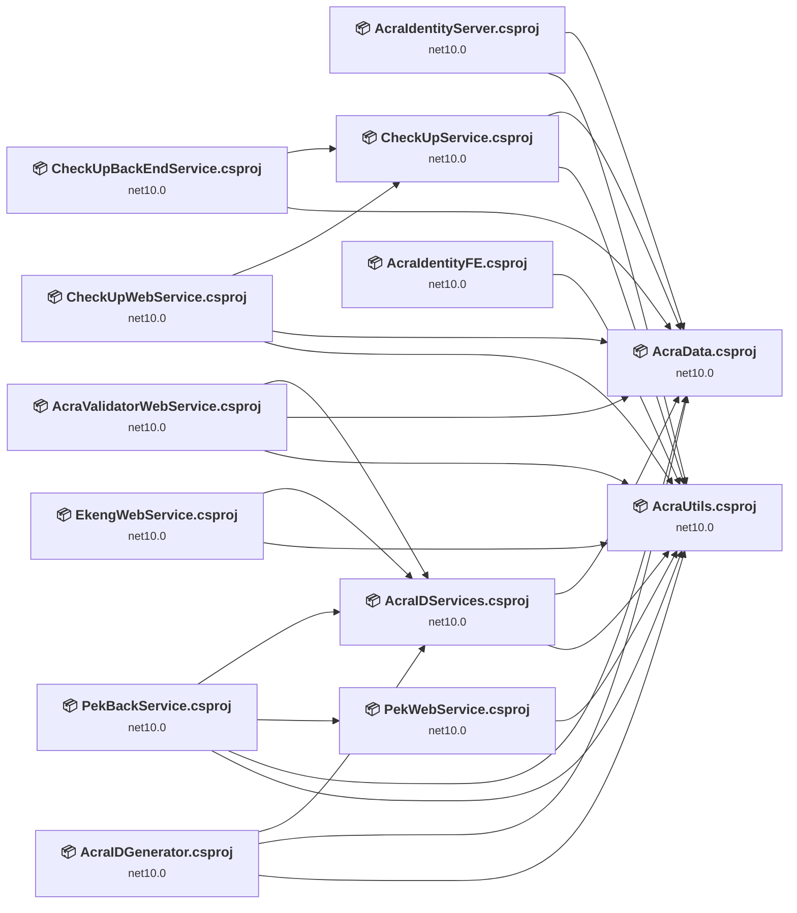

## Project Details

### AcraData\AcraData.csproj

#### Project Info

- **Current Target Framework:** net10.0
- **Proposed Target Framework:** net11.0
- **SDK-style**: True
- **Project Kind:** ClassLibrary
- **Dependencies**: 0
- **Dependants**: 8
- **Number of Files**: 176
- **Number of Files with Incidents**: 1
- **Lines of Code**: 9584
- **Estimated LOC to modify**: 0+ (at least 0.0% of the project)

#### Dependency Graph

Legend:
📦 SDK-style project
⚙️ Classic project

```mermaid
flowchart TB
    subgraph upstream["Dependants (8)"]
        P2["<b>📦&nbsp;AcraIdentityServer.csproj</b><br/><small>net10.0</small>"]
        P4["<b>📦&nbsp;CheckUpService.csproj</b><br/><small>net10.0</small>"]
        P5["<b>📦&nbsp;CheckUpWebService.csproj</b><br/><small>net10.0</small>"]
        P6["<b>📦&nbsp;AcraIDServices.csproj</b><br/><small>net10.0</small>"]
        P8["<b>📦&nbsp;AcraValidatorWebService.csproj</b><br/><small>net10.0</small>"]
        P10["<b>📦&nbsp;CheckUpBackEndService.csproj</b><br/><small>net10.0</small>"]
        P12["<b>📦&nbsp;PekBackService.csproj</b><br/><small>net10.0</small>"]
        P13["<b>📦&nbsp;AcraIDGenerator.csproj</b><br/><small>net10.0</small>"]
        click P2 "#acraidentityserveracraidentityservercsproj"
        click P4 "#packupservicecheckupservicecsproj"
        click P5 "#packupwebservicecheckupwebservicecsproj"
        click P6 "#acraidservicesacraidservicescsproj"
        click P8 "#acravalidatorwebserviceacravalidatorwebservicecsproj"
        click P10 "#checkupbackendservicecheckupbackendservicecsproj"
        click P12 "#pekbackservicepekbackservicecsproj"
        click P13 "#acraidgeneratoracraidgeneratorcsproj"
    end
    subgraph current["AcraData.csproj"]
        MAIN["<b>📦&nbsp;AcraData.csproj</b><br/><small>net10.0</small>"]
        click MAIN "#acradataacradatacsproj"
    end
    P2 --> MAIN
    P4 --> MAIN
    P5 --> MAIN
    P6 --> MAIN
    P8 --> MAIN
    P10 --> MAIN
    P12 --> MAIN
    P13 --> MAIN

```

### API Compatibility

| Category | Count | Impact |
| :--- | :---: | :--- |
| 🔴 Binary Incompatible | 0 | High - Require code changes |
| 🟡 Source Incompatible | 0 | Medium - Needs re-compilation and potential conflicting API error fixing |
| 🔵 Behavioral change | 0 | Low - Behavioral changes that may require testing at runtime |
| ✅ Compatible | 16958 |  |
| ***Total APIs Analyzed*** | ***16958*** |  |

### AcraIdentityFE\AcraIdentityFE.csproj

#### Project Info

- **Current Target Framework:** net10.0
- **Proposed Target Framework:** net11.0
- **SDK-style**: True
- **Project Kind:** AspNetCore
- **Dependencies**: 1
- **Dependants**: 0
- **Number of Files**: 22
- **Number of Files with Incidents**: 3
- **Lines of Code**: 591
- **Estimated LOC to modify**: 7+ (at least 1.2% of the project)

#### Dependency Graph

Legend:
📦 SDK-style project
⚙️ Classic project

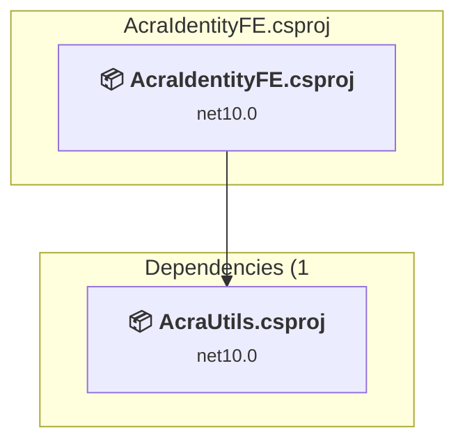

### API Compatibility

| Category | Count | Impact |
| :--- | :---: | :--- |
| 🔴 Binary Incompatible | 1 | High - Require code changes |
| 🟡 Source Incompatible | 5 | Medium - Needs re-compilation and potential conflicting API error fixing |
| 🔵 Behavioral change | 1 | Low - Behavioral changes that may require testing at runtime |
| ✅ Compatible | 2270 |  |
| ***Total APIs Analyzed*** | ***2277*** |  |

### AcraIdentityServer\AcraIdentityServer.csproj

#### Project Info

- **Current Target Framework:** net10.0
- **Proposed Target Framework:** net11.0
- **SDK-style**: True
- **Project Kind:** AspNetCore
- **Dependencies**: 2
- **Dependants**: 0
- **Number of Files**: 32
- **Number of Files with Incidents**: 1
- **Lines of Code**: 899
- **Estimated LOC to modify**: 0+ (at least 0.0% of the project)

#### Dependency Graph

Legend:
📦 SDK-style project
⚙️ Classic project

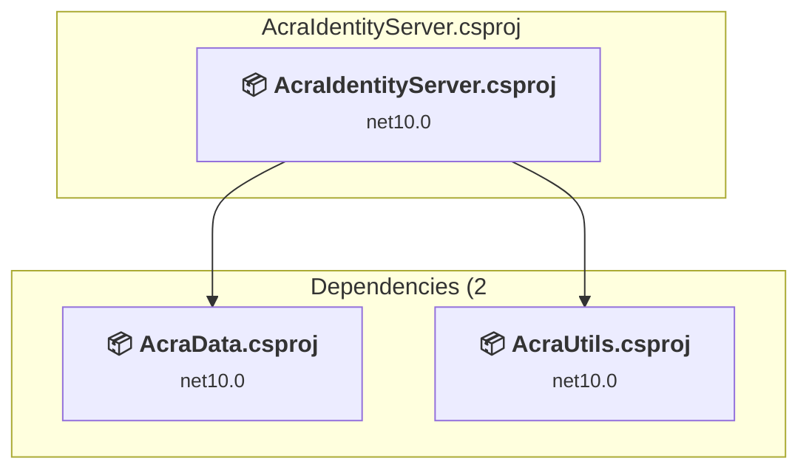

### API Compatibility

| Category | Count | Impact |
| :--- | :---: | :--- |
| 🔴 Binary Incompatible | 0 | High - Require code changes |
| 🟡 Source Incompatible | 0 | Medium - Needs re-compilation and potential conflicting API error fixing |
| 🔵 Behavioral change | 0 | Low - Behavioral changes that may require testing at runtime |
| ✅ Compatible | 0 |  |
| ***Total APIs Analyzed*** | ***0*** |  |

### AcraIDGenerator\AcraIDGenerator.csproj

#### Project Info

- **Current Target Framework:** net10.0
- **Proposed Target Framework:** net11.0
- **SDK-style**: True
- **Project Kind:** AspNetCore
- **Dependencies**: 3
- **Dependants**: 0
- **Number of Files**: 24
- **Number of Files with Incidents**: 4
- **Lines of Code**: 2031
- **Estimated LOC to modify**: 13+ (at least 0.6% of the project)

#### Dependency Graph

Legend:
📦 SDK-style project
⚙️ Classic project

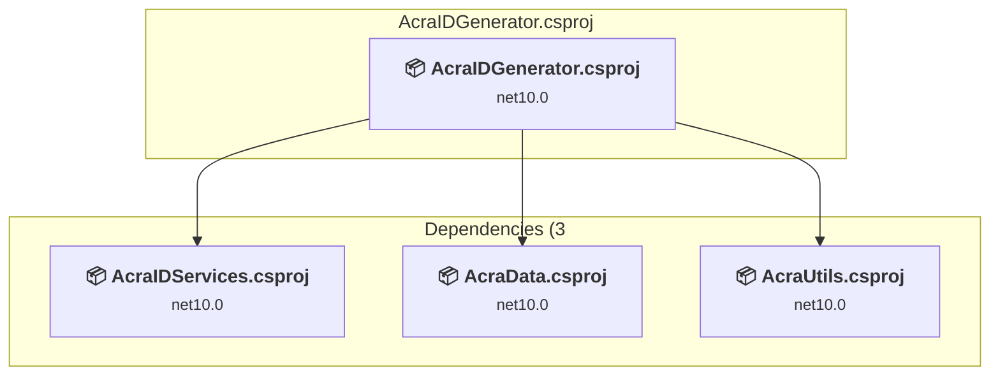

### API Compatibility

| Category | Count | Impact |
| :--- | :---: | :--- |
| 🔴 Binary Incompatible | 2 | High - Require code changes |
| 🟡 Source Incompatible | 4 | Medium - Needs re-compilation and potential conflicting API error fixing |
| 🔵 Behavioral change | 7 | Low - Behavioral changes that may require testing at runtime |
| ✅ Compatible | 4468 |  |
| ***Total APIs Analyzed*** | ***4481*** |  |

### AcraIDServices\AcraIDServices.csproj

#### Project Info

- **Current Target Framework:** net10.0
- **Proposed Target Framework:** net11.0
- **SDK-style**: True
- **Project Kind:** ClassLibrary
- **Dependencies**: 2
- **Dependants**: 4
- **Number of Files**: 30
- **Number of Files with Incidents**: 7
- **Lines of Code**: 6201
- **Estimated LOC to modify**: 31+ (at least 0.5% of the project)

#### Dependency Graph

Legend:
📦 SDK-style project
⚙️ Classic project

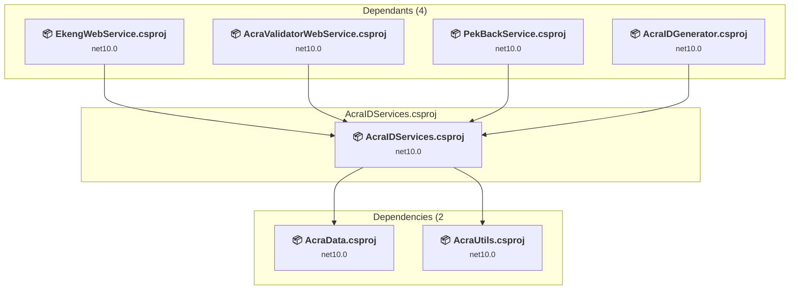

### API Compatibility

| Category | Count | Impact |
| :--- | :---: | :--- |
| 🔴 Binary Incompatible | 0 | High - Require code changes |
| 🟡 Source Incompatible | 0 | Medium - Needs re-compilation and potential conflicting API error fixing |
| 🔵 Behavioral change | 31 | Low - Behavioral changes that may require testing at runtime |
| ✅ Compatible | 7607 |  |
| ***Total APIs Analyzed*** | ***7638*** |  |

### AcraUtils\AcraUtils.csproj

#### Project Info

- **Current Target Framework:** net10.0
- **Proposed Target Framework:** net11.0
- **SDK-style**: True
- **Project Kind:** ClassLibrary
- **Dependencies**: 0
- **Dependants**: 10
- **Number of Files**: 29
- **Number of Files with Incidents**: 3
- **Lines of Code**: 1059
- **Estimated LOC to modify**: 3+ (at least 0.3% of the project)

#### Dependency Graph

Legend:
📦 SDK-style project
⚙️ Classic project

```mermaid
flowchart TB
    subgraph upstream["Dependants (10)"]
        P2["<b>📦&nbsp;AcraIdentityServer.csproj</b><br/><small>net10.0</small>"]
        P4["<b>📦&nbsp;CheckUpService.csproj</b><br/><small>net10.0</small>"]
        P5["<b>📦&nbsp;CheckUpWebService.csproj</b><br/><small>net10.0</small>"]
        P6["<b>📦&nbsp;AcraIDServices.csproj</b><br/><small>net10.0</small>"]
        P7["<b>📦&nbsp;EkengWebService.csproj</b><br/><small>net10.0</small>"]
        P8["<b>📦&nbsp;AcraValidatorWebService.csproj</b><br/><small>net10.0</small>"]
        P9["<b>📦&nbsp;AcraIdentityFE.csproj</b><br/><small>net10.0</small>"]
        P11["<b>📦&nbsp;PekWebService.csproj</b><br/><small>net10.0</small>"]
        P12["<b>📦&nbsp;PekBackService.csproj</b><br/><small>net10.0</small>"]
        P13["<b>📦&nbsp;AcraIDGenerator.csproj</b><br/><small>net10.0</small>"]
        click P2 "#acraidentityserveracraidentityservercsproj"
        click P4 "#packupservicecheckupservicecsproj"
        click P5 "#packupwebservicecheckupwebservicecsproj"
        click P6 "#acraidservicesacraidservicescsproj"
        click P7 "#ekengwebserviceekengwebservicecsproj"
        click P8 "#acravalidatorwebserviceacravalidatorwebservicecsproj"
        click P9 "#acraidentityfeacraidentityfecsproj"
        click P11 "#pekwebservicepekwebservicecsproj"
        click P12 "#pekbackservicepekbackservicecsproj"
        click P13 "#acraidgeneratoracraidgeneratorcsproj"
    end
    subgraph current["AcraUtils.csproj"]
        MAIN["<b>📦&nbsp;AcraUtils.csproj</b><br/><small>net10.0</small>"]
        click MAIN "#acrautilsacrautilscsproj"
    end
    P2 --> MAIN
    P4 --> MAIN
    P5 --> MAIN
    P6 --> MAIN
    P7 --> MAIN
    P8 --> MAIN
    P9 --> MAIN
    P11 --> MAIN
    P12 --> MAIN
    P13 --> MAIN

```

### API Compatibility

| Category | Count | Impact |
| :--- | :---: | :--- |
| 🔴 Binary Incompatible | 0 | High - Require code changes |
| 🟡 Source Incompatible | 0 | Medium - Needs re-compilation and potential conflicting API error fixing |
| 🔵 Behavioral change | 3 | Low - Behavioral changes that may require testing at runtime |
| ✅ Compatible | 973 |  |
| ***Total APIs Analyzed*** | ***976*** |  |

### AcraValidatorWebService\AcraValidatorWebService.csproj

#### Project Info

- **Current Target Framework:** net10.0
- **Proposed Target Framework:** net11.0
- **SDK-style**: True
- **Project Kind:** AspNetCore
- **Dependencies**: 3
- **Dependants**: 0
- **Number of Files**: 25
- **Number of Files with Incidents**: 3
- **Lines of Code**: 650
- **Estimated LOC to modify**: 8+ (at least 1.2% of the project)

#### Dependency Graph

Legend:
📦 SDK-style project
⚙️ Classic project

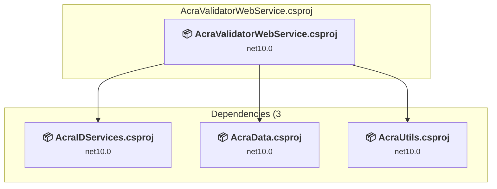

### API Compatibility

| Category | Count | Impact |
| :--- | :---: | :--- |
| 🔴 Binary Incompatible | 3 | High - Require code changes |
| 🟡 Source Incompatible | 4 | Medium - Needs re-compilation and potential conflicting API error fixing |
| 🔵 Behavioral change | 1 | Low - Behavioral changes that may require testing at runtime |
| ✅ Compatible | 2518 |  |
| ***Total APIs Analyzed*** | ***2526*** |  |

### CheckUpBackEndService\CheckUpBackEndService.csproj

#### Project Info

- **Current Target Framework:** net10.0
- **Proposed Target Framework:** net11.0
- **SDK-style**: True
- **Project Kind:** AspNetCore
- **Dependencies**: 2
- **Dependants**: 0
- **Number of Files**: 19
- **Number of Files with Incidents**: 3
- **Lines of Code**: 443
- **Estimated LOC to modify**: 5+ (at least 1.1% of the project)

#### Dependency Graph

Legend:
📦 SDK-style project
⚙️ Classic project

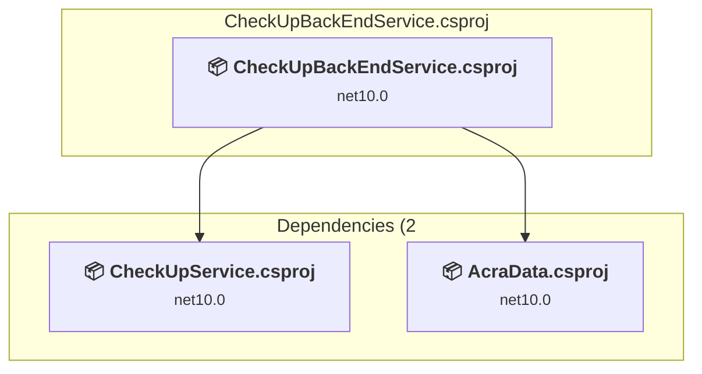

### API Compatibility

| Category | Count | Impact |
| :--- | :---: | :--- |
| 🔴 Binary Incompatible | 0 | High - Require code changes |
| 🟡 Source Incompatible | 4 | Medium - Needs re-compilation and potential conflicting API error fixing |
| 🔵 Behavioral change | 1 | Low - Behavioral changes that may require testing at runtime |
| ✅ Compatible | 2181 |  |
| ***Total APIs Analyzed*** | ***2186*** |  |

### EkengWebService\EkengWebService.csproj

#### Project Info

- **Current Target Framework:** net10.0
- **Proposed Target Framework:** net11.0
- **SDK-style**: True
- **Project Kind:** AspNetCore
- **Dependencies**: 2
- **Dependants**: 0
- **Number of Files**: 21
- **Number of Files with Incidents**: 3
- **Lines of Code**: 585
- **Estimated LOC to modify**: 7+ (at least 1.2% of the project)

#### Dependency Graph

Legend:
📦 SDK-style project
⚙️ Classic project

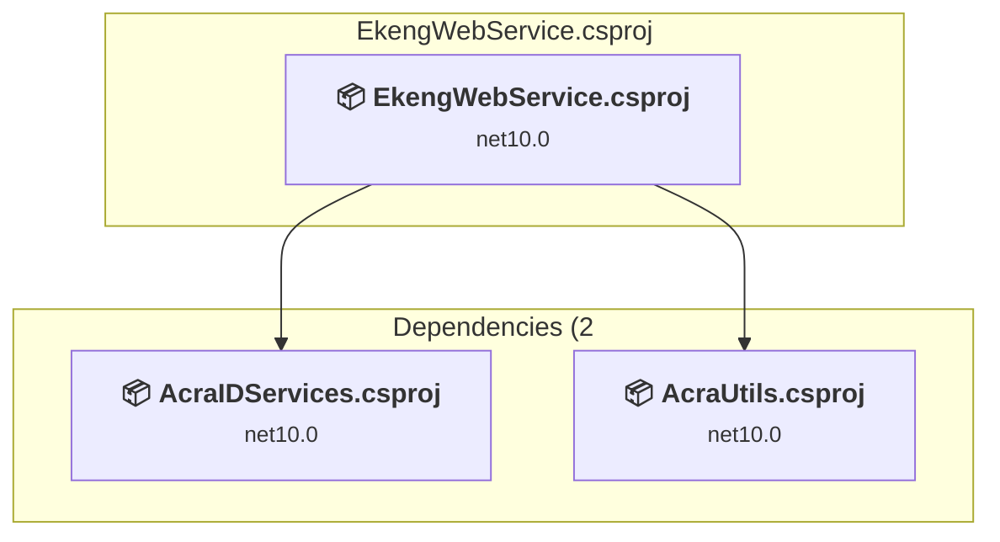

### API Compatibility

| Category | Count | Impact |
| :--- | :---: | :--- |
| 🔴 Binary Incompatible | 2 | High - Require code changes |
| 🟡 Source Incompatible | 4 | Medium - Needs re-compilation and potential conflicting API error fixing |
| 🔵 Behavioral change | 1 | Low - Behavioral changes that may require testing at runtime |
| ✅ Compatible | 2188 |  |
| ***Total APIs Analyzed*** | ***2195*** |  |

### PackUpService\CheckUpService.csproj

#### Project Info

- **Current Target Framework:** net10.0
- **Proposed Target Framework:** net11.0
- **SDK-style**: True
- **Project Kind:** ClassLibrary
- **Dependencies**: 2
- **Dependants**: 2
- **Number of Files**: 6
- **Number of Files with Incidents**: 2
- **Lines of Code**: 697
- **Estimated LOC to modify**: 1+ (at least 0.1% of the project)

#### Dependency Graph

Legend:
📦 SDK-style project
⚙️ Classic project

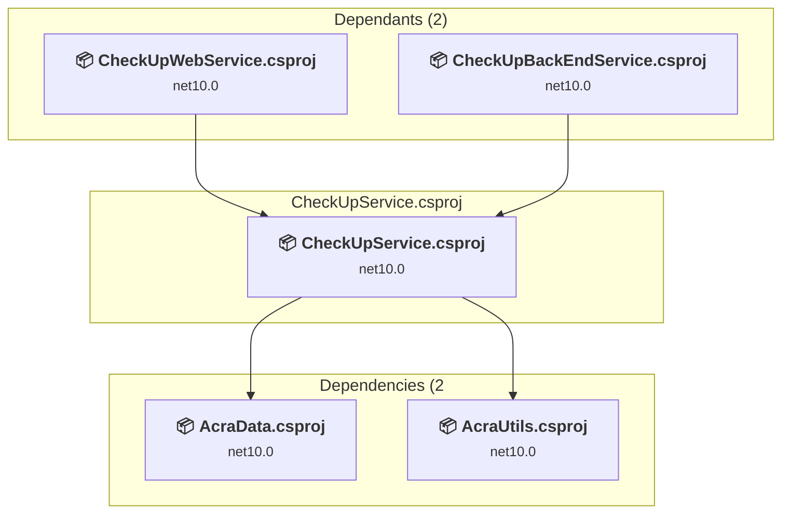

### API Compatibility

| Category | Count | Impact |
| :--- | :---: | :--- |
| 🔴 Binary Incompatible | 0 | High - Require code changes |
| 🟡 Source Incompatible | 1 | Medium - Needs re-compilation and potential conflicting API error fixing |
| 🔵 Behavioral change | 0 | Low - Behavioral changes that may require testing at runtime |
| ✅ Compatible | 628 |  |
| ***Total APIs Analyzed*** | ***629*** |  |

### PackUpWebService\CheckUpWebService.csproj

#### Project Info

- **Current Target Framework:** net10.0
- **Proposed Target Framework:** net11.0
- **SDK-style**: True
- **Project Kind:** AspNetCore
- **Dependencies**: 3
- **Dependants**: 0
- **Number of Files**: 28
- **Number of Files with Incidents**: 6
- **Lines of Code**: 816
- **Estimated LOC to modify**: 21+ (at least 2.6% of the project)

#### Dependency Graph

Legend:
📦 SDK-style project
⚙️ Classic project

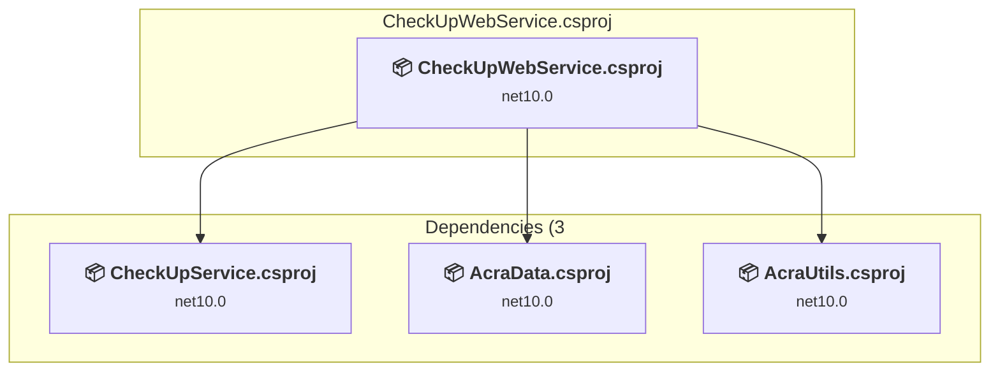

### API Compatibility

| Category | Count | Impact |
| :--- | :---: | :--- |
| 🔴 Binary Incompatible | 6 | High - Require code changes |
| 🟡 Source Incompatible | 9 | Medium - Needs re-compilation and potential conflicting API error fixing |
| 🔵 Behavioral change | 6 | Low - Behavioral changes that may require testing at runtime |
| ✅ Compatible | 2768 |  |
| ***Total APIs Analyzed*** | ***2789*** |  |

#### Project Technologies and Features

| Technology | Issues | Percentage | Migration Path |
| :--- | :---: | :---: | :--- |
| Legacy Cryptography | 1 | 4.8% | Obsolete or insecure cryptographic algorithms that have been deprecated for security reasons. These algorithms are no longer considered secure by modern standards. Migrate to modern cryptographic APIs using secure algorithms. |

### PekBackService\PekBackService.csproj

#### Project Info

- **Current Target Framework:** net10.0
- **Proposed Target Framework:** net11.0
- **SDK-style**: True
- **Project Kind:** AspNetCore
- **Dependencies**: 4
- **Dependants**: 0
- **Number of Files**: 16
- **Number of Files with Incidents**: 3
- **Lines of Code**: 545
- **Estimated LOC to modify**: 5+ (at least 0.9% of the project)

#### Dependency Graph

Legend:
📦 SDK-style project
⚙️ Classic project

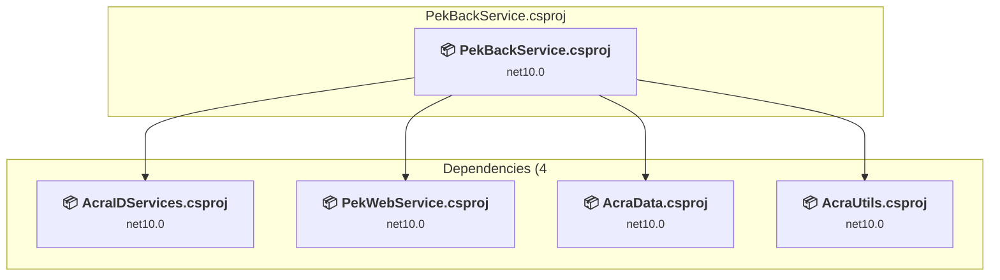

### API Compatibility

| Category | Count | Impact |
| :--- | :---: | :--- |
| 🔴 Binary Incompatible | 0 | High - Require code changes |
| 🟡 Source Incompatible | 4 | Medium - Needs re-compilation and potential conflicting API error fixing |
| 🔵 Behavioral change | 1 | Low - Behavioral changes that may require testing at runtime |
| ✅ Compatible | 2323 |  |
| ***Total APIs Analyzed*** | ***2328*** |  |

### PekWebService\PekWebService.csproj

#### Project Info

- **Current Target Framework:** net10.0
- **Proposed Target Framework:** net11.0
- **SDK-style**: True
- **Project Kind:** AspNetCore
- **Dependencies**: 1
- **Dependants**: 1
- **Number of Files**: 21
- **Number of Files with Incidents**: 5
- **Lines of Code**: 2882
- **Estimated LOC to modify**: 112+ (at least 3.9% of the project)

#### Dependency Graph

Legend:
📦 SDK-style project
⚙️ Classic project

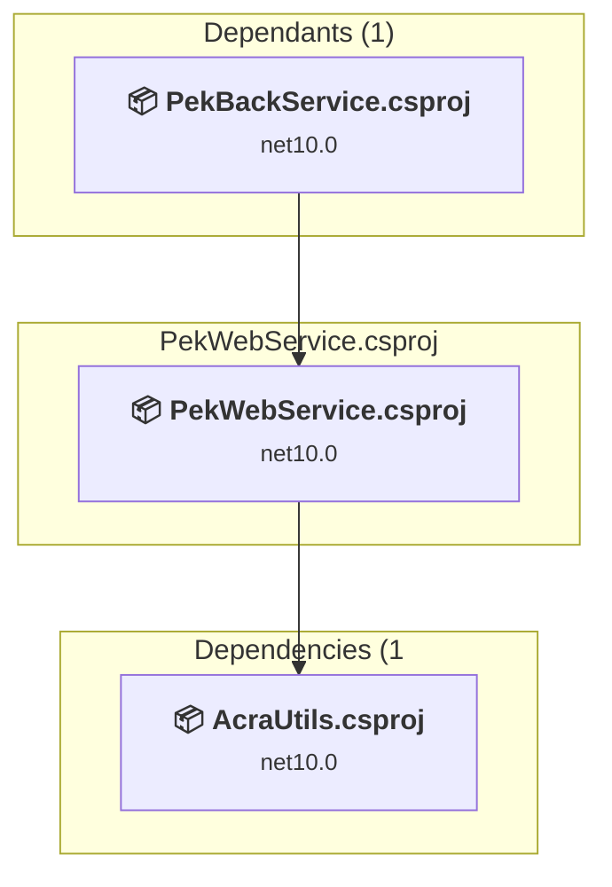

### API Compatibility

| Category | Count | Impact |
| :--- | :---: | :--- |
| 🔴 Binary Incompatible | 1 | High - Require code changes |
| 🟡 Source Incompatible | 89 | Medium - Needs re-compilation and potential conflicting API error fixing |
| 🔵 Behavioral change | 22 | Low - Behavioral changes that may require testing at runtime |
| ✅ Compatible | 3596 |  |
| ***Total APIs Analyzed*** | ***3708*** |  |

#### Project Technologies and Features

| Technology | Issues | Percentage | Migration Path |
| :--- | :---: | :---: | :--- |
| WCF Client APIs | 85 | 75.9% | WCF client-side APIs for building service clients that communicate with WCF services. These APIs are available as exact equivalents via NuGet packages - add System.ServiceModel.* NuGet packages (System.ServiceModel.Http, System.ServiceModel.Primitives, System.ServiceModel.NetTcp, etc.) |

